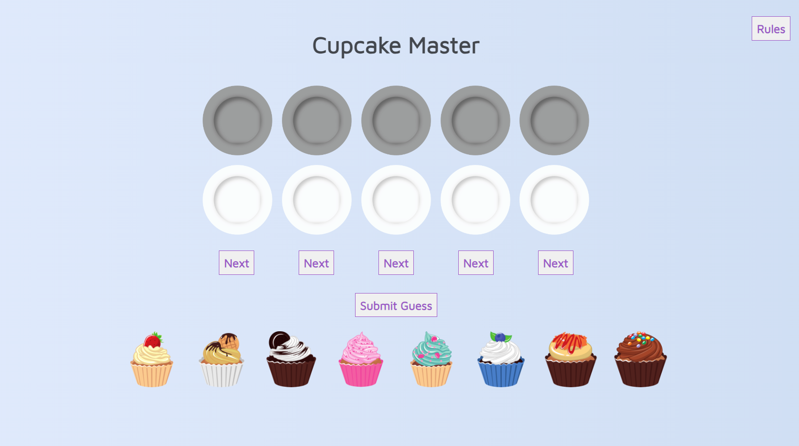
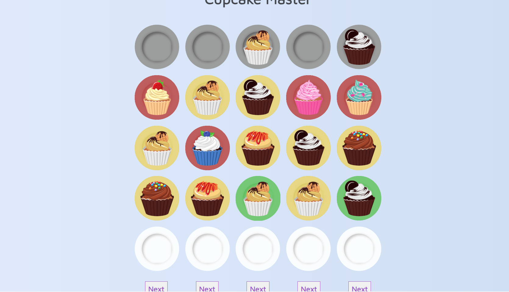
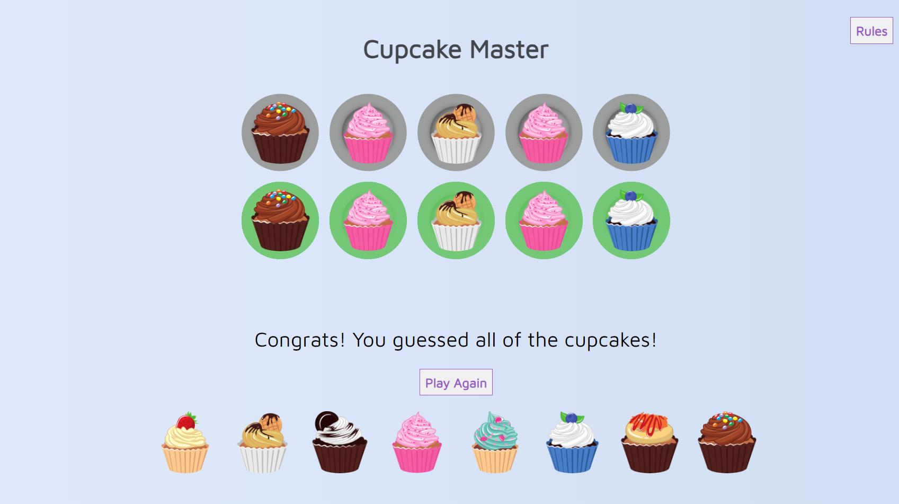

# Cupcake Master
 Cupcake Master is a mastermind style game using 8 possible cupcakes to create a secret code of 5 total.

 This game was initially created as a project in my Software Engineering Immersive at General Assembly. Tasked with creating a Mastermind game, I decided to get a little whimsical with it! I hope you enjoy some hard won cupcakes!

## Screenshots
  
  

## Technology Used
HTML, CSS, and Javascript

## Getting Started
[Launch the game](https://taylorlottdixon.github.io/mastermind/)

### Next Steps
* Rules button creates a modal instead

* Add 1 Player or Two Player modes
    * in 2 player, one player chooses the pattern, hits submit, and then the board is populated

* Confetti animation on win

* Stylize radial menu for cupcake choice on plate click

* Game remembers correct answers when building the next row, so player does not need to select the same answer over an over

* Animation on correct guess
    * cupcake spins
    * on all correct, pulse cupcakes in a wave

* Difficulty levels